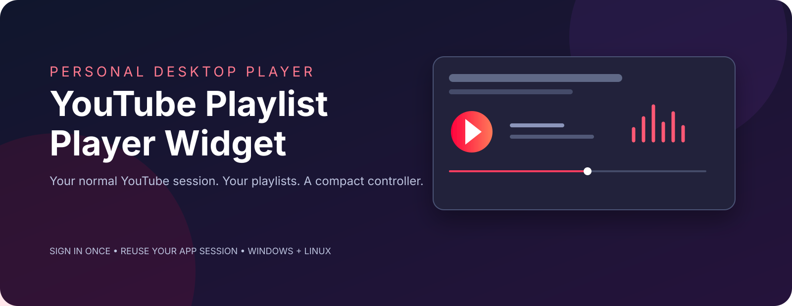

# YouTube Playlist Player Widget

<p align="center">
  
</p>

<p align="center">A personal desktop controller for YouTube playlists on Windows and Linux.</p>

This project gives you a small controller window and an app-owned YouTube window. Sign in normally to YouTube once inside the app; Electron keeps that app profile and its session cookies for future launches. Edge or Chrome do not need to stay open, and no Google Cloud Console project is required.

## Features

- App-owned Chromium profile with persistent YouTube sign-in.
- Separate YouTube playback window and compact controller window.
- Play/pause, previous/next, seek, volume, shuffle, and repeat Off/All/One when YouTube exposes those modes.
- Save one playlist URL in Settings and preload it on the next launch.
- Compact one-line mode with the current title and core actions.
- Optional always-on-top controller window.
- No backend, credential collection, cookie copying, downloads, or media extraction.

## Quick start

Install Node.js 20 or newer, then run:

```bash
npm install
npm start
```

On the first launch:

1. Sign in to YouTube in the app-owned YouTube window using the normal Google flow.
2. Open a playlist and copy its URL.
3. Click **Settings** in the controller, paste the `youtube.com/playlist?list=...` URL, and save.
4. Use **Compact** for the one-line controller or **Expand** for seek, volume, shuffle, repeat, and playlist actions.

The app stores its session in Electron's persistent `youtube-compact-player` profile. It never imports cookies from an external browser. Closing Edge or Chrome does not affect the app.

## Windows and Omarchy

The same source tree runs on both systems:

```bash
npm install
npm start
```

On Omarchy, use the Node.js installation provided by your preferred package manager. A distributable installer is not included yet; this repository currently provides a reproducible source launch. The app's own YouTube window is the playback surface, so the external browser can be closed.

## Development check

```bash
npm test
```

The check validates the manifest/prototype contract, standalone IPC wiring, required controls, and source-selection regression flow. Live YouTube sign-in, playlist editing, minimized playback, and Linux window-manager behavior still need a real browser run.

## Architecture

`main.cjs` owns two Electron windows and the persistent YouTube session. `preload.cjs` exposes a narrow IPC bridge to the controller. `app.js` renders state and sends validated commands. YouTube remains responsible for authentication, ads, playback restrictions, account switching, and playlist writes.

The older `manifest.json` / `background.js` / `youtube-adapter.js` implementation is retained as a browser-extension prototype. It is not required by the standalone app and cannot continue playback after its source browser tab closes.

## Limits

YouTube's page structure can change, so unsupported controls report an error instead of guessing. The app uses the normal YouTube web player and does not extract or separate audio. Background playback while the YouTube window is hidden or minimized depends on the browser and YouTube's current behavior; validate it with the account and content you use.
